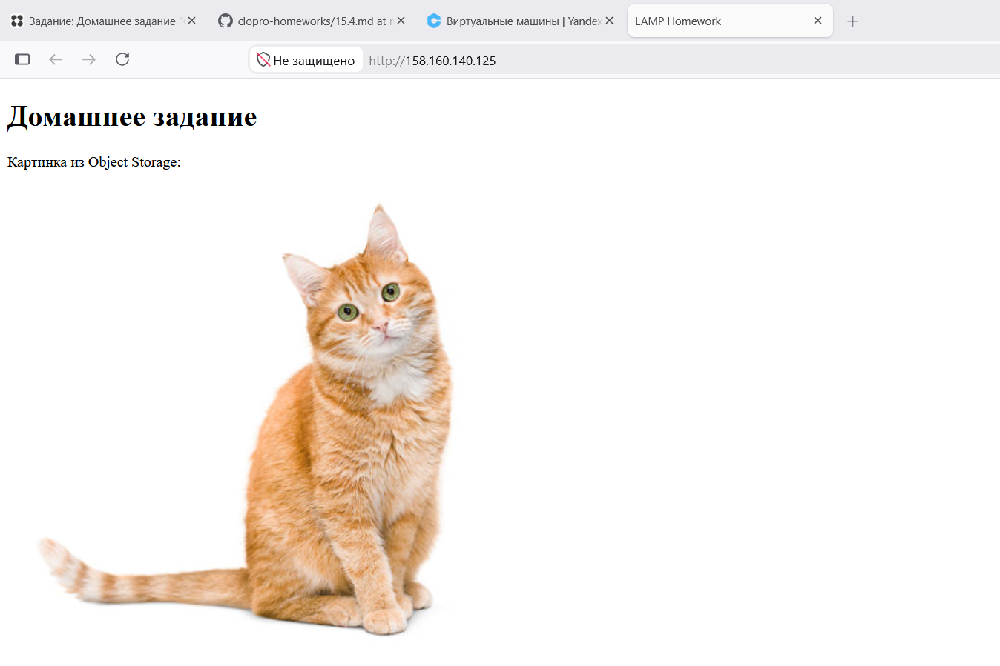
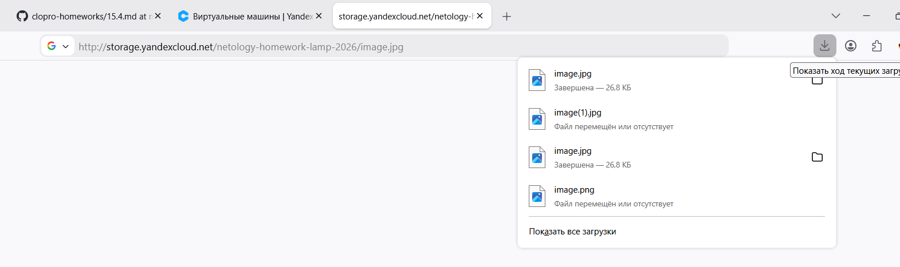
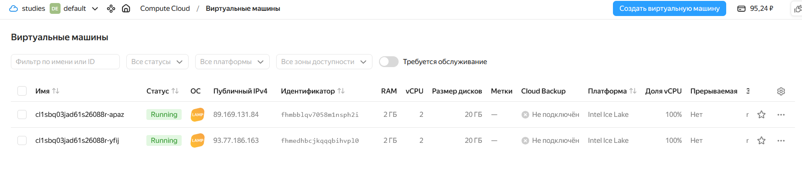
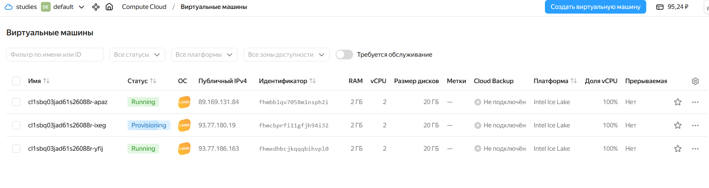
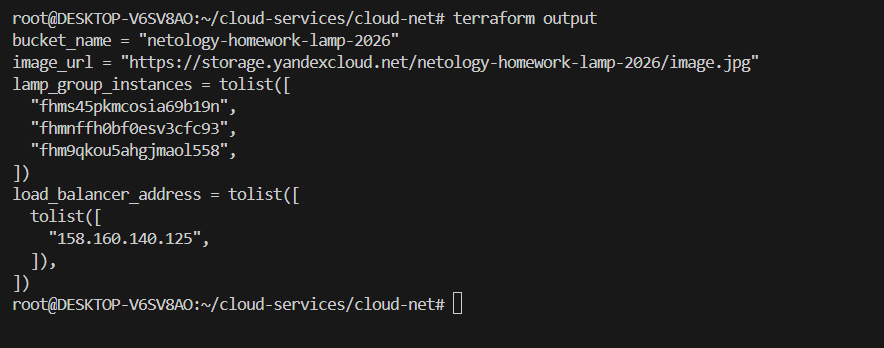

# Домашняя работа: Object Storage, Instance Group, Network Load Balancer

## Цель

Создать в Yandex Cloud:

1. Бакет в Object Storage с публично доступной картинкой.
2. Группу виртуальных машин с шаблоном LAMP и веб-страницей, содержащей ссылку на картинку из бакета.
3. Сетевой балансировщик, распределяющий трафик между ВМ группы.

Вся инфраструктура создана и управляется с помощью Terraform.

---

## Схема инфраструктуры

```text
                     Internet
                        │
                   ┌────┴────┐
                   │   LB    │
                   │ 158.160 │
                   │.140.125 │
                   └────┬────┘
                        │ port 80
            ┌───────────┼───────────┐
            │           │           │
       ┌────┴───┐ ┌────┴───┐ ┌────┴───┐
       │ lamp-1 │ │ lamp-2 │ │ lamp-3 │
       │.10.20  │ │ .10.7  │ │.10.21  │
       └────┬───┘ └────┬───┘ └────┬───┘
            │           │           │
            └───────────┼───────────┘
                        │
                 public subnet
                 192.168.10.0/24
                        │
                  homework-vpc
                        │
            ┌───────────┴───────────┐
            │                       │
     Object Storage          Instance Group
     bucket: netology-       lamp-group (3 VM)
     homework-lamp-2026      LAMP image
     image.jpg (public)      user-data: index.html
```

---

## 1. VPC и публичная подсеть

Создана VPC `homework-vpc` и публичная подсеть:

* имя: `public`
* CIDR: `192.168.10.0/24`
* зона: `ru-central1-a`

Конфигурация находится в [`network.tf`](./network.tf).

---

## 2. Object Storage — бакет с картинкой

Создан бакет:

* имя: `netology-homework-lamp-2026`
* анонимный доступ: `read` (включён через `yc storage bucket update`)
* файл: `image.jpg` (картинка с котиком)

Публичный URL файла:

```
https://storage.yandexcloud.net/netology-homework-lamp-2026/image.jpg
```

Для доступа к бакету создан отдельный Service Account `storage-sa` с ролью `storage.admin` и статический ключ доступа.

Конфигурация находится в [`storage.tf`](./storage.tf).

---

## 3. Группа виртуальных машин (Instance Group)

Создана Instance Group `lamp-group` с тремя ВМ:

| Параметр         | Значение                      |
| ---------------- | ----------------------------- |
| Шаблон          | LAMP (`fd827b91d99psvq5fjit`) |
| Платформа        | `standard-v3`                 |
| CPU / RAM        | 2 cores / 2 GB                |
| Диск             | 20 GB `network-hdd`           |
| Подсеть          | `public` (192.168.10.0/24)    |
| NAT              | включён (публичные IP)        |
| Количество ВМ    | 3 (фиксированное масштабирование) |

### Стартовая веб-страница

Через `user-data` (cloud-init) на каждой ВМ создаётся файл `/var/www/html/index.html` со ссылкой на картинку из бакета:

```html

```

### Проверка состояния ВМ (Health Check)

Настроена HTTP-проверка:

* порт: 80
* путь: `/`
* интервал: 10 сек
* таймаут: 5 сек
* healthy threshold: 2
* unhealthy threshold: 3

Конфигурация находится в [`instance-group.tf`](./instance-group.tf), шаблон страницы — в [`files/user-data.yaml`](./files/user-data.yaml).

---

## 4. Сетевой балансировщик

Создан Network Load Balancer `lamp-load-balancer`:

| Параметр     | Значение         |
| ------------ | ---------------- |
| Тип          | `EXTERNAL`       |
| Протокол     | TCP              |
| Порт         | 80               |
| Target port  | 80               |
| Внешний IP   | `158.160.140.125`|

Балансировщик привязан к target group, автоматически управляемой Instance Group. Health check на стороне балансировщика: HTTP порт 80, путь `/`.

Конфигурация находится в [`loadbalancer.tf`](./loadbalancer.tf).

---

## 5. Проверка работоспособности

### Веб-страница через балансировщик

Откройте в браузере:

```
http://158.160.140.125/
```

Отобразится страница «Домашнее задание» с картинкой из Object Storage.



### Картинка из бакета напрямую

```
https://storage.yandexcloud.net/netology-homework-lamp-2026/image.jpg
```



### Удаление одной ВМ

Удалите одну ВМ из группы через консоль или CLI:

```bash
yc compute instance delete <instance-id>
```

После удаления балансировщик перестаёт отправлять трафик на удалённую ВМ. Оставшиеся две ВМ продолжают обрабатывать запросы. Health check подтверждает, что удалённая ВМ недоступна.



### Восстановление ВМ

Instance Group автоматически создаёт новую ВМ взамен удалённой (fixed scale = 3). После восстановления балансировщик начинает распределять трафик между тремя ВМ.



---

## 6. Terraform outputs

```text
bucket_name = "netology-homework-lamp-2026"
image_url = "https://storage.yandexcloud.net/netology-homework-lamp-2026/image.jpg"
lamp_group_instances = ["<id-1>", "<id-2>", "<id-3>"]
load_balancer_address = [["158.160.140.125"]]
```



---

## 7. Манифесты Terraform

В репозитории находятся исходные Terraform-манифесты:

* [`versions.tf`](./versions.tf) — версии Terraform и провайдера
* [`provider.tf`](./provider.tf) — настройка Yandex Cloud provider
* [`variables.tf`](./variables.tf) — переменные
* [`network.tf`](./network.tf) — VPC и публичная подсеть
* [`storage.tf`](./storage.tf) — бакет Object Storage, SA, статический ключ
* [`instance-group.tf`](./instance-group.tf) — группа ВМ с LAMP, health check
* [`loadbalancer.tf`](./loadbalancer.tf) — сетевой балансировщик
* [`outputs.tf`](./outputs.tf) — Terraform outputs
* [`files/user-data.yaml`](./files/user-data.yaml) — cloud-init шаблон для веб-страницы
* [`files/image.jpg`](./files/image.jpg) — картинка для загрузки в бакет

Секретные значения и Terraform state в репозиторий не добавляются.

---

## 9. Итог

В результате создана следующая инфраструктура:

| Ресурс             | Параметры                              |
| ------------------ | -------------------------------------- |
| VPC                | `homework-vpc`                         |
| Public subnet      | `192.168.10.0/24`                      |
| Object Storage     | `netology-homework-lamp-2026`          |
| Картинка           | `image.jpg` (публичный доступ)         |
| Instance Group     | `lamp-group` — 3 ВМ, LAMP              |
| Network LB         | `lamp-load-balancer` — `158.160.140.125`|

Проверено:

* бакет создан, картинка доступна по публичному URL;
* группа из 3 ВМ с LAMP-шаблоном работает в публичной подсети;
* веб-страница на каждой ВМ содержит ссылку на картинку из бакета;
* HTTP health check настроен и работает;
* сетевой балансировщик распределяет трафик между ВМ;
* при удалении ВМ группа автоматически восстанавливает нужное количество;
* `terraform plan` не обнаруживает изменений.
