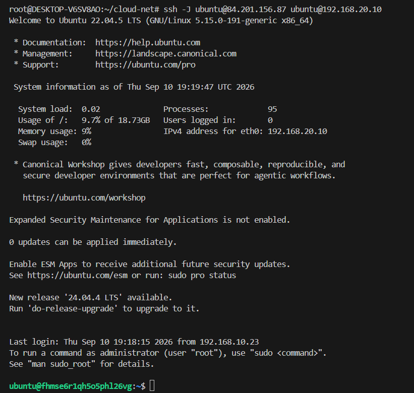

# Домашняя работа: Terraform — Yandex Cloud

## Цель

Создать в Yandex Cloud сетевую инфраструктуру с публичной и приватной подсетями, NAT-инстансом и маршрутизацией трафика из приватной подсети в Интернет.

Вся инфраструктура создана и управляется с помощью Terraform.

---

## Схема инфраструктуры

```text
                           Internet
                              │
                    ┌─────────┴─────────┐
                    │                   │
              NAT instance          public-vm
             192.168.10.254       192.168.10.x
             62.84.119.222         84.201.156.87
                    │                   │
                    └─────────┬─────────┘
                              │
                    public subnet
                    192.168.10.0/24
                              │
                    ┌─────────┴─────────┐
                    │   Route Table     │
                    │  0.0.0.0/0 →     │
                    │  192.168.10.254   │
                    └─────────┬─────────┘
                              │
                    private subnet
                    192.168.20.0/24
                              │
                         private-vm
                        192.168.20.10
                         no public IP
                              │
                              ▼
                         NAT instance
                              │
                              ▼
                           Internet
```

---

## 1. VPC и публичная подсеть

Создана пустая VPC `homework-vpc`.

Публичная подсеть:

* имя: `public`
* CIDR: `192.168.10.0/24`
* зона: `ru-central1-a`

Конфигурация находится в [`network.tf`](./network.tf).

---

## 2. NAT-инстанс

Создан NAT-инстанс:

* имя: `nat-instance`
* внутренний IP: `192.168.10.254`
* публичный IP: `62.84.119.222`
* подсеть: `public`
* Marketplace image ID: `fd80mrhj8fl2oe87o4e1`

Конфигурация находится в [`nat.tf`](./nat.tf).

---

## 3. Публичная VM

Создана виртуальная машина `public-vm`.

Параметры:

* подсеть: `public`
* публичный IP: `84.201.156.87`
* ОС: Ubuntu 22.04 LTS
* доступ по SSH осуществляется с локального компьютера.

Конфигурация находится в [`public-vm.tf`](./public-vm.tf).

### Проверка доступа в Интернет

С `public-vm` выполнена проверка:

```bash
curl 2ip.me
```

Результат показывает доступ в Интернет и публичный IP `84.201.156.87`.


---

## 4. Приватная подсеть

Создана приватная подсеть:

* имя: `private`
* CIDR: `192.168.20.0/24`
* зона: `ru-central1-a`

Для приватной подсети создана таблица маршрутизации:

```text
0.0.0.0/0 → 192.168.10.254
```

Route table привязана только к приватной подсети.

Конфигурация находится в:

* [`network.tf`](./network.tf)
* [`route.tf`](./route.tf)

---

## 5. Приватная VM

Создана VM `private-vm`.

Параметры:

* внутренний IP: `192.168.20.10`
* подсеть: `private`
* публичный IP отсутствует
* NAT на сетевом интерфейсе отключён.

Конфигурация находится в [`private-vm.tf`](./private-vm.tf).

---

## 6. Проверка доступа к private-vm

Доступ к приватной VM выполняется через публичную VM с использованием SSH Jump Host:

```bash
ssh -i ~/.ssh/id_ed25519 \
  -J ubuntu@84.201.156.87 \
  ubuntu@192.168.20.10
```

Таким образом, приватный SSH-ключ остаётся на локальном компьютере и не копируется на `public-vm`.



---

## 7. Проверка NAT

На `private-vm` проверены:

```bash
curl 2ip.me
```

Private VM имеет адрес:

```text
192.168.20.10
```

При этом внешний адрес при обращении в Интернет:

```text
62.84.119.222
```

Это подтверждает, что трафик из приватной подсети выходит в Интернет через NAT-инстанс.


---

## 8. Terraform state

Список ресурсов, которыми управляет Terraform:

```text
data.yandex_compute_image.ubuntu
yandex_compute_instance.nat
yandex_compute_instance.private
yandex_compute_instance.public
yandex_vpc_network.homework
yandex_vpc_route_table.private
yandex_vpc_subnet.private
yandex_vpc_subnet.public
```


---

## 9. Terraform outputs

Текущие outputs:

```text
nat_public_ip = "62.84.119.222"
public_vm_ip  = "84.201.156.87"
```


---

## 10. Проверка Terraform

Финальная команда:

```bash
terraform plan
```

Результат:

```text
No changes. Your infrastructure matches the configuration.
```

Это подтверждает, что фактическое состояние инфраструктуры соответствует Terraform-конфигурации.


---

## 11. Манифесты Terraform

В репозитории находятся исходные Terraform-манифесты:

* [`versions.tf`](./versions.tf) — версии Terraform и провайдера
* [`provider.tf`](./provider.tf) — настройка Yandex Cloud provider
* [`variables.tf`](./variables.tf) — переменные
* [`network.tf`](./network.tf) — VPC и подсети
* [`route.tf`](./route.tf) — таблица маршрутизации
* [`nat.tf`](./nat.tf) — NAT-инстанс
* [`public-vm.tf`](./public-vm.tf) — публичная VM
* [`private-vm.tf`](./private-vm.tf) — приватная VM
* [`outputs.tf`](./outputs.tf) — Terraform outputs

Секретные значения и Terraform state в репозиторий не добавляются.

---

## 12. Итог

В результате создана следующая инфраструктура:

| Ресурс         | Параметры                          |
| -------------- | ---------------------------------- |
| VPC            | `homework-vpc`                     |
| Public subnet  | `192.168.10.0/24`                  |
| NAT instance   | `192.168.10.254` / `62.84.119.222` |
| Public VM      | `84.201.156.87`                    |
| Private subnet | `192.168.20.0/24`                  |
| Private VM     | `192.168.20.10`                    |
| Route          | `0.0.0.0/0 → 192.168.10.254`       |

Проверено:

* создание инфраструктуры полностью выполняется Terraform;
* public VM имеет доступ в Интернет;
* private VM не имеет публичного IP;
* private VM имеет доступ в Интернет через NAT;
* внешний IP private VM соответствует публичному IP NAT-инстанса;
* SSH-доступ к private VM осуществляется через public VM;
* `terraform plan` не обнаруживает изменений.
